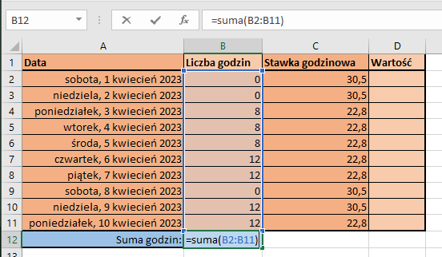

# Podstawowe operacje w programie Excel 2016

1. Wprowadź następujące etykiety do komórek:  

2. Pokoloruj zakresy komórek, tak aby tabela stała się bardziej czytelna:  

3. Dodaj dwa rodzaje obramowań, oraz pogrubienie tekstu komórek zawierających etykiety.  

4. Wprowadź przykładowe dane.  

5. Zmień format daty na długą.

5. Chcemy, aby dane z kolumny **B** były sumowane, w tym celu wykonaj następujące kroki:  
Dodaj etykietę "Suma godzin:" w komórce A12.  
Dodaj formułę *=suma(B2:B11)* w komórce **B12** i naciśnij *Enter*  
  
  

6. Zmień format liczb kolumn **C** i **D** na "Walutowe".

7. Wykonaj operację mnożenia komórek kolumn B i C (liczba godzin x stawka godzinowa):  
W komórce **D2** wprowadź formułę: *=iloczyn(B2;C2)* i naciśnij *Enter*  
  
  
8. Zaznacz komórkę D2, najedź na prawy dolny róg komórki do pojawienia się czarnego krzyżyka. Kliknij i przeciągnij w ten sposób komrkę do komórki **D11**. W ten sposób formuła z komórki D2 zostanie automatycznie zastosowana do następnych.   
  
  

9. Spróbuj teraz samodzielnie dodać sumę pieniędzy, tak, aby arkusz ostatecznie wyglądał w następujący sposób:  
