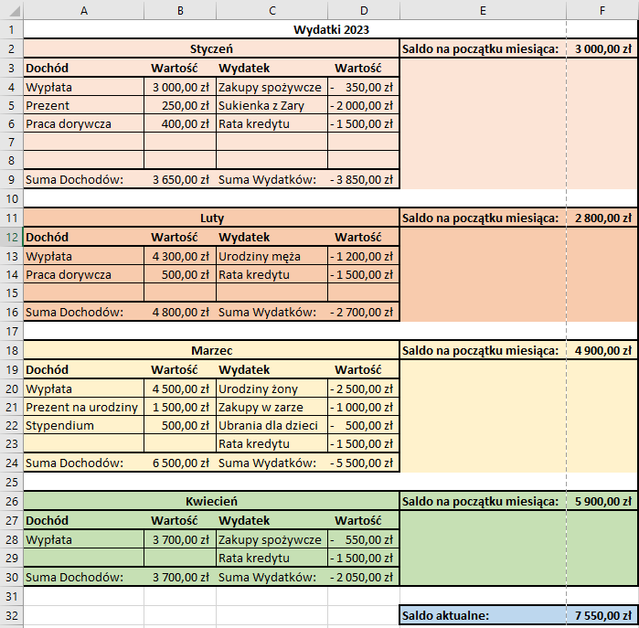

**Budżet miesięczny**
Utwórz nowy arkusz kalkulacyjny Excel.

 1.  Utwórz arkusz budżetowy, który oblicza miesięczne wydatki i dochody.  
 
Możesz utworzyć tabelę na kilka sposobów:
**Sposób 1:** Dochody są w oddzielnej kolumnie niż wydatki - jest to bardziej przejrzyste i nie ma konieczności dodawania znaku "-" w przypadku wydatków. Ma to też swoje minusy, ale im bardziej przejrzyście tym lepiej.
 
| Dochody       | Wartość | Wydatki          | Wartość |
|---------------|---------|------------------|---------|
| Wypłata       | 5000    | Zakupy spożywcze | -300    |
| Prezent       | 250     | Sukienka z Zary  | -1700   |
| Suma dochodów:|         | Suma wydatków:   | -1700   |

**Sposób 2:** Dochody i wydatki znajdują się w jednej kolumnie i różnią się tylko znakiem **+/-** (znaku "+" nie piszemy) jest to stosunkowo proste i szybkie rozwiązanie, ale ma też swoje minusy - w przypadku dużej ilości, arkusz będzie dłuuugi i wąski, a także będzie trzeba zastosować bardziej skomplikowane operacje i funkcje w celu podliczania statystyk, sum itp.

| Dochody/Wydatki  | Wartość |
|------------------|---------|
| Wypłata          | 5000    |
| Zakupy spożywcze | -300    |
| Prezent          | 250     |
| Sukienka z Zary  | -1700   |
| Suma dochodów:   |         |
| Suma wydatków:   |         |

**Uwaga:** to przykładowa tabela - może okazać się że koniecznie będzie trzeba dodać na przykład dodatkową kolumnę, wiersz lub komórkę, jak *miesiąc*, *oszczędności*, lub *kategoria* do jakiej zalicza się dochód/wydatek.

4. Wprowadź dane dotyczące przykładowego budżetu, w tym koszty miesięczne, dochody i oszczędności. 
5. Sformatuj komórki zawierające liczby, aby poprawić ich czytelność. Zastosuj w tym celu format walutowy.
6. Oblicz sumę wydatków w każdym miesiącu. Spróbuj zrobić to poprzez:
	- autosumowanie
	- użycie funkcji `suma` i wybranie zakresu
	- ręczne wpisanie funkcji wraz z zakresem
7. Dodaj wykres kołowy, aby pokazać procentowy podział wydatków.
8. Jeżeli dodano kategorie wydatków, spróbuj utworzyć wykres udziału kategorii wydatków i dochodów.
9. Skopiuj formułę obliczającą sumę wydatków do innych miesięcy.
10. Posortuj koszty w kolejności rosnącej lub malejącej. 
11. Użyj funkcji "wyszukaj i zamień", aby zmienić nazwę jednej kategorii wydatków na inną. 
12. Stwórz tabelę przestawną, aby przeanalizować swoje wydatki i dochody z różnych perspektyw. 
13. Zapisz swoje dane budżetowe w pliku Excela, aby móc później do nich wrócić i aktualizować.

Zdjęcie przykładowego arkusza:

